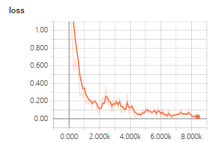

# LSTM
利用LSTM做文本分类

## Usage

### 1. 数据预处理
在data文件中，先使用`data_clean.py`对文本数据进行预处理

最后处理的格式信息如下：
```
df, word_vecs, word_cab_num, sentence_max_len, class_num
```
`df`:句子字典列表。其中包括句子的text、分类、split等辅助信息
```
{
"label":         #标签
"num_words":int  #句子长度
"text":str       #句子
"split":[0,10]   #十折交叉使用
}
```
`word_vecs`:文本中所有词的词向量表示  
`word_cab_num`:文本中共有多少不同的词汇  
`sentence_max_len`:句子的最大长度  
`class_num`:多分类问题分几类  


### 2.模型超参
模型参数在`rnn_model.py`进行相关的设置。其中需要修改的包括：
```python
class TRNNConfig(object):
    self.embedding_dim = 100     # 词向量维度
    self.num_layers= 2           # 隐藏层层数
    self.hidden_dim = 128        # 隐藏层神经元
    self.rnn = 'lstm'             # lstm 或 gru

    self.dropout_keep_prob = 0.8 # dropout保留比例
    self.learning_rate = 1e-3    # 学习率

    self.batch_size = 128          # 每批训练大小
    self.num_epochs = 10           # 总迭代轮次
```
启动参数包括`rnn_run.py`的一些路径等配置信息
```
train_data = "../data/word_vec.p"  #配置数据清洗后生成的数据路径
label = "brand"                    #1中所述df的类别标签名
```

### 3.运行
```python
rnn_run.py train #训练&验证
rnn_run.py test  #测试
```

## 模型介绍
### 1.LSTM
lstm作为加入了attention机制的rnn网络，对长文本具有很好的记忆效果，其主要归功于模型结构。    


以下是一个lstm单元的结构（**一个lstm单元也就是网络中的一层,即由上述num_layers控制**）  

其中输出即是一个`hidden_dim`的向量，以上两个参数控制lstm最核心的网络架构。  

### 2.GRU
gru可以说是lstm的初代版本，一个GRU单元如下所示  
  

## 实验结果
本次实验是帮师兄做了的一个关于设备识别分类的工作。从50W条设备banner信息中对设备品牌和型号进行识别。  
因为数据相对规整，用lstm处理得到的效果也非常好，正确率能达到99%    
  



## LSTM和GRU的区别
先给出一些结论：  
- GRU和LSTM的性能在很多任务上不分伯仲。
- GRU 参数更少因此更容易收敛，但是数据集很大的情况下，LSTM表达性能更好。
- 从结构上来说，GRU只有两个门（update和reset），LSTM有三个门（forget，input，output），GRU直接将hidden state 传给下一个单元，而LSTM则用memory cell 把hidden state 包装起来。
