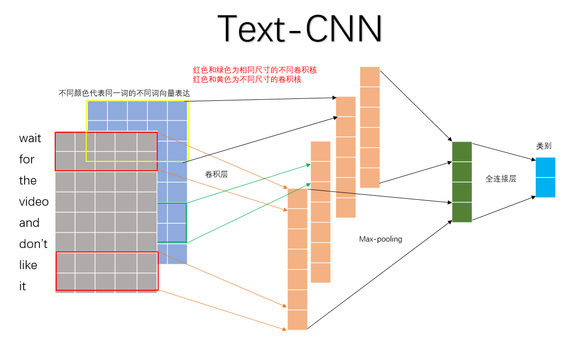

# NLP-Model
Learn and demonstrate some  classical model


## 目录

* [Text-CNN](#text-cnn)
* [LSTM](#lstm)
* [Glove](#glove)


## <span id="text-cnn">Text-CNN</span>
### 1. 模型展示


### 2. 参数与超参数

**sequence_length**  
Q: 对于CNN, 输入与输出都是固定的，可每个句子长短不一, 怎么处理?  
A: 需要做定长处理, 比如定为n, 超过的截断, 不足的补0. 注意补充的0对后面的结果没有影响，因为后面的max-pooling只会输出最大值，补零的项会被过滤掉.  

**num_classes**  
多分类, 分为几类.  

**vocabulary_size**  
语料库的词典大小, 记为|D|.


**embedding_size**  
将词向量的维度, 由原始的 |D| 降维到 embedding_size.


**filter_size_arr**  
多个不同size的filter.


### 3. demo流程
```C
str_length = 36  
word_vec = 128  
filter_size = [2,3,4] 每种尺寸2个filter  
```


### 3.实验部分
#### 1 数据集介绍
1.1 实验的过程中只使用了[MR数据集](https://www.cs.cornell.edu/people/pabo/movie-review-data/)，验证方式是10 folds的交叉验证方式。
> 数据集中包含了5331 positive and 5331 negative processed sentences / snippets. Introduced in Pang/Lee ACL 2005. Released July 2005.

2.1 词向量包含以下三种(**可以任意选一种或多种累加当作一个词不同的channel**):
+ **CNN-rand**:句子中的的word vector都是随机初始化的，同时当做CNN训练过程中需要优化的参数；
+ **CNN-static**:句子中的word vector是使用word2vec预先对Google News dataset(about 100 billion words)进行训练好的词向量表中的词向量。且在CNN训练过程中作为固定的输入，不作为优化的参数；
+ **CNN-non-static**:句子中的word vector是使用word2vec预先对Google News dataset(about 100 billion words)进行训练好的词向量表中的词向量。在CNN训练过程中作为固定的输入，做为CNN训练过程中**需要优化**的参数；

说明：

> + GoogleNews-vectors-negative300.bin.gz词向量表是通过word2vec使用命令预先训练好，花费时间较长。
已经训练好的：[GoogleNews-vectors-negative300.bin.gz百度云盘下载地址](https://pan.baidu.com/share/init?surl=OglaQBBO30d5KdzZNNdRSg) 密码:18yf
> + word2vec预先训练命令如：```./word2vec -train text8(语料) -output vectors.bin(输出词向量表) -cbow(训练使用模型方式) 0 -size 48 -window 5 -negative 0 -hs 1 -sample 1e-4 -threads 20 -binary 1 -iter 100```
> + 除了使用word2vec对语料库进行预先训练外，也可以使用glove或FastText进行词向量训练。


#### 2.文件介绍

2.1 **process\_data.py**：加载Google训练的词向量表GoogleNews-vectors-negative300.bin，并对文本数据做一些预处理，使其转化为NN易用的形式，并将其存储在文件中。  
最终存储为一个word\_vec.p,其文件存储的内容是[**随机词向量表，已训练好的词向量表， 词频字典， 最大句子长度， revs**];  
其中revs是一个结构体列表,列表中的每个元素如下所示：
```
{
"y":0/1          #标签
"num_words":int  #句子长度
"text":str       #句子
"split":[0,10]   #十折交叉使用
}
```
2.2 **text_cnn_main.py**: 主程序文件。读取以上word_vec.p文件内容，设置一些配置信息并设置一些网络运行时需要的参数。  
2.3 **text_cnn_model.py**：text-cnn模型文件。


#### 3.实验结果展示


### 4.经验分享

在工作用到TextCNN做query推荐，并结合先关的文献，谈几点经验：  
1、TextCNN是一个n-gram特征提取器，对于训练集中没有的n-gram不能很好的提取。对于有些n-gram，可能过于强烈，反而会干扰模型，造成误分类。   
2、TextCNN对词语的**顺序不敏感**，在query推荐中，我把正样本分词后得到的term做随机排序，正确率并没有降低太多，当然，其中一方面的原因短query本身对term的顺序要求不敏感。          
3、TextCNN擅长长本文分类，在这一方面可以做到很高正确率。    
4、TextCNN在模型结构方面有很多参数可调，具体参看文末的文献。  

参考文献  
《Convolutional Neural Networks for Sentence Classification》   
《A Sensitivity Analysis of (and Practitioners’ Guide to) Convolutional Neural Networks for Sentence Classification》 

---
> [参考博客](https://jianwenjun.xyz/2018/03/16/%E5%8D%B7%E7%A7%AF%E7%A5%9E%E7%BB%8F%E7%BD%91%E7%BB%9C-TextCNN-%E5%9C%A8%E5%8F%A5%E5%AD%90%E5%88%86%E7%B1%BB%E4%B8%8A%E7%9A%84%E5%AE%9E%E7%8E%B0/)   
> [参考博客](https://blog.csdn.net/u012762419/article/details/79561441)   
特此感谢

---

## <span id="lstm">LSTM</span>


## <span id="glove">Glove</span>
